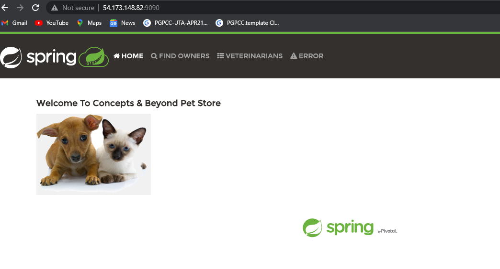

# DevSecOps Lab 4 - DAST - Dynamic Application Security Testing

## Task - Implement DAST in your GitHub Actions workflow using OWAPS ZAP

<p>
 DAST is a process of testing an application or software product in an operating state

**Zed Attack Proxy (ZAP)** is a free, open-source dynamic testing tool being maintained under the umbrella of the Open Web Application Security Project (OWASP). ZAP is designed specifically for testing web applications and is both flexible and extensible.

At its core, ZAP is what is known as a “man-in-the-middle proxy.” It stands between the tester’s browser and the web application so that it can intercept and inspect messages sent between browser and web application, modify the contents if needed, and then forward those packets on to the destination. It can be used as a stand-alone application, and as a daemon process.

spend 5 mins to learn More about ZAP here - https://www.zaproxy.org/getting-started/ 

Dynamic testing needs a running application. <br>
For this lab the infrastructure is already created for you. <br>
Just go through the following instructions to deploy the application to staging environment - 5 mins


```
cd /home/ec2-user/environment/devsecops-labs
# to make sure you are at project root directory
cp labs/lab4.1-DeployQA.yml .github/workflows/build.yml

```

### **Change the port number.** 
* Open *application.properties file(at devsecops-labs/src/main/resources)* files as shown below.

    

Change the last digit of ```server.port:9090``` to match with your team number. </P>
i.e. 
  *student1* -  `server.port:9091`</p>
  *student2* - `server.port:9092` </p>
  *student3* -  `server.port:9093`</p>
  *student4* - `server.port:9094` and so on

<br>

* Open Stop.sh at the folder root (*devsecops-labs*)

    

Change the port number to the same as in the previous file and to match with your team number</p>
`sudo kill -9 $(sudo lsof -t -i:9090)`</br>
change to </p>
i.e. 
  *student1* -  `sudo kill -9 $(sudo lsof -t -i:9091)` </p>
  *student2* - `sudo kill -9 $(sudo lsof -t -i:9092)` </p>
  *student3* -  `sudo kill -9 $(sudo lsof -t -i:9091)` </p>
  *student4* - `sudo kill -9 $(sudo lsof -t -i:9092)` and so on

### Change the artifacts location ###

**Open your build.yml file and rename the S3Folder section to match with your number </p> Search for the line** `S3Folder: githubactions0` **and update it with your team number.**
S3Folder: githubactions`<your team number>`</p>

>e.g.</p>
>student1 will have  `S3Folder: githubactions1`</p>
>student2 will have  `S3Folder: githubactions2`</p>
>student3 will have  `S3Folder: githubactions3`</p>
>student4 will have  `S3Folder: githubactions4`</p>

 Push the code
```
git add .
git commit -m "adding upload action"
git push 
```
>*username - enter your username* </p>
>*password - enter the Personal access token provided to you.*

<br>

View your running application at this link.

http://54.211.147.170:9090/

 **Replace the IP address with the one retrieved from following command.**

Run the following command from Cloud9 Terminal

`aws ec2 describe-instances --instance-id i-0edaf3625fea3c0bd  --query 'Reservations[*].Instances[*].PublicIpAddress'`

**Change the port number to match with your port number.**

    


<br><br>
### Add DAST steps ###

Go through the instructions here for adding DAST action

https://github.com/marketplace/actions/owasp-zap-full-scan 

You will need target, which is a running web app.  
Use your application URL from above step.

> **Help?** Verify your DAST steps with pre-built actoins file. 

refer your ZAP action commands with the pre-built commands under job   
zap_scan: at <i> labs/lab4.2-ZAP.yml </i>

<br>
you can also copy the pre-built files from labs location by running the following command. 

```
cd /home/ec2-user/environment/devsecops-labs
# to make sure you are at project root directory
cp labs/lab4.2-ZAP.yml .github/workflows/build.yml
```

Run the following command to push the change. 

```
git add .
git commit -m "adding upload action"
git push 
```
>*username - enter your username* </p>
>*password - enter the Personal access token provided to you.*

<br>

Once the workflow completes, you can view the results of the scan in issues section of your GitHub Repo.

<!-- <screenshot> -->